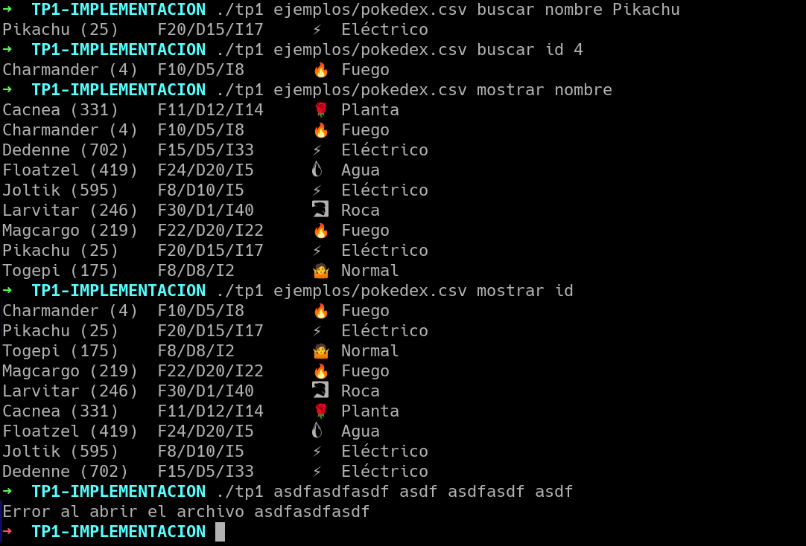

# TP1: Archivos, strings y muchos punteros

Se pide implementar la funcionalidad del archivo **.h** provisto. En este achivo se declaran funcionalidades que permiten leer una pokedex desde un archivo con datos de diferentes pokemon y luego realizar operaciones de búsqueda sobre la misma.

Adicionalmente se pide la implementación de ***tp1.c*** que dado un archivo de pokedex y dos o tres parámetros, carga los datos y ejecuta la operación pedida.

Por último, es obligatorio implementar ***pruebas_alumno.c*** con pruebas de la funcionalidad de ***pokedex.h***.

## Ejemplos de uso

  - **./tp1 pokedex.csv buscar nombre pikachu**: Busca un pokemon con el nombre pikachu y si lo encuentra muestra la información por pantalla.
  - **./tp1 pokedex.csv buscar id 25**: Busca un pokemon con el id 25 y si lo encuentra muestra la información por pantalla.
  - **./tp1 pokedex.csv buscar tipo agua**: Busca uno o mas pokemones con el tipo agua y si los encuentra muestra la información de cada uno por pantalla.
  - **./tp1 pokedex.csv mostrar nombre**: Muestra todos los pokemon por orden alfabetico
  - **./tp1 pokedex.csv mostrar id**: Muestra todos los pokemon por orden numerico

---

## Consejos para la elaboración del trabajo

**LEER EL ENUNCIADO** primero y luego **la descripción de las funciones**. Importantísimo. 

**LEER EL ENUNCIADO** primero y luego **la descripción de las funciones**. Importantísimo. 

**LEER EL ENUNCIADO** primero y luego **la descripción de las funciones**. Importantísimo. 

**LEER EL ENUNCIADO** primero y luego **la descripción de las funciones**. Importantísimo. 

**LEER EL ENUNCIADO** primero y luego **la descripción de las funciones**. Importantísimo. 

**LEER EL ENUNCIADO** primero y luego **la descripción de las funciones**. Importantísimo. 

**LEER EL ENUNCIADO** primero y luego **la descripción de las funciones**. Importantísimo. 

**LEER EL ENUNCIADO** primero y luego **la descripción de las funciones**. Importantísimo. 

**LEER EL ENUNCIADO** primero y luego **la descripción de las funciones**. Importantísimo. 

**LEER EL ENUNCIADO** primero y luego **la descripción de las funciones**. Importantísimo. 

**LEER EL ENUNCIADO** primero y luego **la descripción de las funciones**. Importantísimo. 

**LEER EL ENUNCIADO** primero y luego **la descripción de las funciones**. Importantísimo. 

**LEER EL ENUNCIADO** primero y luego **la descripción de las funciones**. Importantísimo. 

**NO** escribas código a lo loco sin compilar cada tanto. Implementá la solución de a poco y compilando a cada paso. Dejar la compilación para el final es uno de los peores errores que podés cometer.

**NO** avances en la implementación si quedan errores sin resolver en alguna prueba. Cada vez que escribas una prueba implementá toda la funcionalidad necesaria para que funcione correctamente. Esto incluye liberar memoria y accesos inválidos a la misma. Solamente una vez que hayas logrado que la prueba pase exitosamente es que podés comenzar a escribir la próxima prueba para continuar el trabajo.

**NO** está permitido modificar los archivos **.h**. Se pueden hacer modificaciones al **makefile**, pero recordá que el trabajo debe ser compilado por el sistema de entregas con las cabeceras y el **makefile** original. Caso contrario el trabajo se da por desaprobado.

---

## Puntos teóricos

 - Explicar la elección de la estructura para implementar la funcionalida dpedida. Justifique el uso de cada uno de los campos de la estructura.
 - Explicar con diagramas cómo quedan dispuestas las estructuras y elementos en memoria.
 - Justificar la complejidad computacional temporal de **cada una** de las funciones que se piden implementar.

## Restricciones

Para este TP no se permiten utilizar las funciones de la biblioteca estándar de ***C*** **qsort**, **bsearch**, etc. Si se requieren dichas funcionalidades deben ser implementadas por el alumno.
