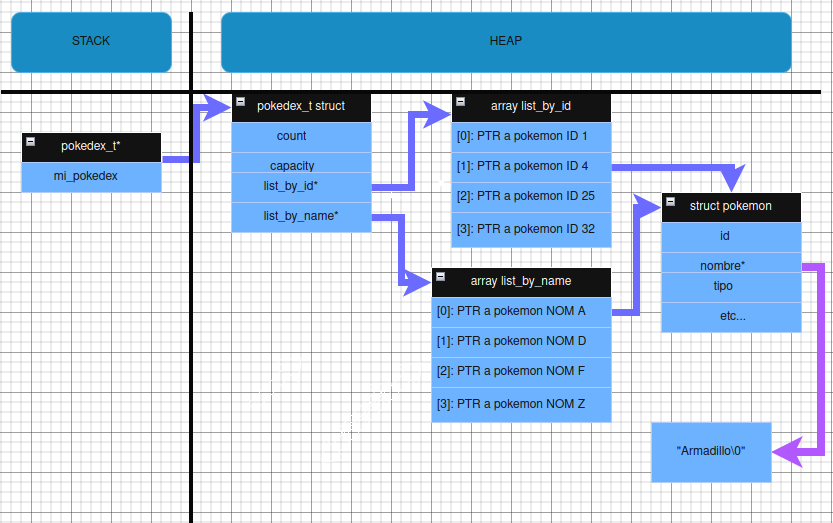

<div align="right">

</div>

# Proyecto TP1-Algo2

## Alumno: (Sebastian Carvajal) - (112652) - (scarvajal@fi.uba.ar)

- Para compilar las pruebas del alumno:

```bash
gcc -g -std=c99 -Wall -Werror -Wconversion -pedantic src/pokedex.c pruebas_alumno.c -o pruebas_alumno
```

- Para compilar el programa principal (TP1):

```bash
gcc -g -std=c99 -Wall -Werror -Wconversion -pedantic src/pokedex.c tp1.c -o tp1
```

- Para ejecutar:

```bash
./pruebas_alumno
./tp1 <ruta_archivo.csv> buscar <nombre|id|tipo> <vaor>
./tp1 <ruta_archivo.csv> mostrar <nombre|id>
```

- Para ejecutar con valgrind:
```bash
valgrind --leak-check=full --show-leak-kinds=all --track-origins=yes ./pruebas_alumno
```

---

# Función: pokedex_abrir

```c
pokedex_t *pokedex_abrir(const char *archivo) {
    ....
}
````

## Propósito

Esta función inicializa y carga una estructura `pokedex_t` (Pokedex) a partir de los datos contenidos en un archivo CSV. Lee los datos de los Pokémon del archivo, los valida y los almacena en memoria, preparando la Pokedex para operaciones posteriores como búsqueda o iteración. La función está diseñada para manejar archivos con líneas de longitud arbitraria gracias a un mecanismo de lectura dinámica.

## Parámetros

* **`const char *archivo`**: Una cadena de caracteres que representa la ruta al archivo CSV que contiene los datos de los Pokémon a cargar.

## Valor de Retorno

* **Éxito**: Devuelve un puntero (`pokedex_t *`) a la estructura Pokedex recién creada y completada con los datos de los Pokémon válidos leídos del archivo. La memoria para esta estructura y su contenido es alocada dinámicamente.

* **Fallo**: Devuelve `NULL` si ocurre alguna de las siguientes condiciones:
    * El parámetro `archivo` es `NULL`.
    * El archivo especificado no puede ser abierto para lectura.
    * Ocurre un error crítico de asignación de memoria (`malloc`/`realloc`) durante el proceso.
    * El archivo se abre correctamente, pero no contiene ningún Pokémon válido (archivo vacío o todas las líneas tienen formato incorrecto).

## Precondiciones

* El archivo especificado por `archivo` debe existir y ser accesible para lectura (a menos que se esté probando el manejo de errores de archivo).

* Se espera que el archivo CSV contenga una línea por cada Pokémon, con los siguientes campos separados por punto y coma (`;`):
    * ID (entero sin signo)
    * Nombre (cadena de caracteres)
    * Tipo (una única letra representando el tipo, ej: `'A'`, `'F'`, `'P'`, `'R'`, `'E'`, `'N'`, `'L'`)
    * Fuerza (entero sin signo)
    * Destreza (entero sin signo)
    * Inteligencia (entero sin signo)

* Ejemplo de línea válida:
    ```csv
    25;Pikachu;E;52;90;50
    ```

## Postcondiciones

### En caso de Éxito

* Se devuelve un puntero válido a una estructura `pokedex_t`.

* La Pokedex contiene todos los Pokémon leídos del archivo que eran válidos hasta encontrar la primera línea inválida. La lectura se detiene al encontrar la primera línea con formato incorrecto.

* Cada Pokémon válido está almacenado en una estructura `struct pokemon` alocada dinámicamente. El nombre de cada Pokémon también se almacena en memoria alocada dinámicamente.

* La Pokedex mantiene internamente dos listas de punteros a las estructuras `struct pokemon`:
    * `pokemon_list_by_id`: Ordenada ascendentemente por el ID del Pokémon.
    * `pokemon_list_by_name`: Ordenada alfabéticamente por el nombre del Pokémon.

* El campo `count` de la estructura `pokedex_t` refleja el número total de Pokémon válidos leídos y almacenados.

* El campo `capacity` refleja la capacidad actual alocada para las listas internas de punteros.

### En caso de Fallo

* Se devuelve `NULL`.

* Si el fallo fue por error de archivo o memoria, se intenta imprimir un mensaje descriptivo del error usando `perror`.

* Si el fallo fue porque no se leyeron Pokémon válidos, se imprime una advertencia en `stderr`.

* Toda la memoria que pudo haber sido alocada durante el intento fallido es liberada antes de retornar `NULL`, garantizando que no haya fugas de memoria.

## Lógica Interna / Algoritmo

1.  **Validación Inicial**: Se verifica que el puntero `archivo` no sea `NULL`.

2.  **Apertura de Archivo**: Se intenta abrir el archivo especificado en modo lectura usando `fopen`. Si falla, se reporta el error y se retorna `NULL`.

3.  **Reserva de Estructura Principal**: Se reserva memoria para la estructura `pokedex_t` usando `malloc`. Si falla, se cierra el archivo y se retorna `NULL`.

4.  **Inicialización de Pokedex**: Se inicializan los campos `count` (a 0) y `capacity` (a `INITIAL_CAPACITY`). Se reserva memoria inicial para los dos arrays de punteros (`pokemon_list_by_id` y `pokemon_list_by_name`). Si alguna reserva falla, se libera toda la memoria previamente reservada (incluyendo la estructura `pokedex_t`) y se retorna `NULL`.

5.  **Preparación para Lectura Dinámica**: Se inicializan las variables necesarias para leer líneas de longitud arbitraria: un puntero `char *line` a `NULL`, `line_capacity` a 0, `line_size` a 0, y flags de control (`fatal_error`, `stop_reading`).

6.  **Bucle Principal de Lectura**: Se entra en un bucle `while` que continúa mientras no ocurra un error fatal de memoria (`fatal_error == false`) y no se haya indicado detener la lectura (`stop_reading == false`).
    - **Lectura de Línea (Dinámica)**: Dentro del bucle principal, se ejecuta un bucle `while` anidado que utiliza `fgetc` para leer el archivo carácter a carácter hasta encontrar un salto de línea (`\n`) o el fin de archivo (`EOF`).

        * **Redimensionamiento de Búfer**: Antes de almacenar cada carácter, se comprueba si el búfer `line` tiene suficiente capacidad (`line_capacity`). Si no, se calcula una nueva capacidad (generalmente duplicando la anterior, o empezando con 128 si era 0) y se llama a `realloc` para intentar agrandar el búfer.

        * **Manejo de Error de `realloc`**: Si `realloc` falla, se marca `fatal_error = true` y se sale de los bucles de lectura.

        * **Almacenamiento de Carácter**: Si hay espacio (o `realloc` fue exitoso), el carácter leído se almacena en `line` y se incrementa `line_size`.

    - **Manejo de `EOF` y Terminación NUL**: Al salir del bucle `fgetc`, se maneja el caso de encontrar `EOF` al inicio de una línea (marcando `stop_reading`). Se asegura espacio y se añade el carácter nulo (`\0`) al final de los caracteres leídos en `line` para formar una cadena C válida. Se incrementa `line_number`.

    - **Parseo de Línea**: Se utiliza la cadena `line` para extraer los campos del Pokémon (ID, Nombre, Tipo, Stats) usando `sscanf`, `strchr` y aritmética de punteros.

        * **Validación de Formato**: Se valida cada paso del parseo. Si se detecta un formato incorrecto (EJ: ID inválido, falta `;`, formato de stats incorrecto, tipo inválido), se imprime un mensaje de error en `stderr`, se marca `stop_reading = true`, se libera la memoria temporal reservada para el nombre de esta línea (si aplica), y se usa `continue` para saltar al final del bucle principal (deteniendo así la lectura del archivo después de esta línea).

        * **Alocación de Nombre**: Si el formato es válido hasta el nombre, se reserva memoria dinámicamente para `dynamic_pokemon_name` usando `malloc` y se copia el nombre desde `line` usando `strncpy`. Si `malloc` falla, se marca `fatal_error = true` y se sale del bucle principal.

    - **Almacenamiento del Pokémon** (si el parseo fue exitoso):
        * **Chequeo de Capacidad de Listas**: Se verifica si los arrays `pokemon_list_*` necesitan crecer (`pokedex->count == pokedex->capacity`).

        * **Redimensionamiento de Listas**: Si es necesario, se duplica `pokedex->capacity` y se usa `realloc` para agrandar ambos arrays (`pokemon_list_by_id`, `pokemon_list_by_name`). Si `realloc` falla, se libera `dynamic_pokemon_name`, se marca `fatal_error = true`, y se sale del bucle principal.

        * **Alocación de `struct pokemon`**: Se reserva memoria para la `struct pokemon` usando `malloc`. Si falla, se libera `dynamic_pokemon_name`, se marca `fatal_error = true`, y se sale del bucle principal.

        * **Armado de Datos**: Se copian los datos parseados (ID, tipo, stats) y el puntero `dynamic_pokemon_name` a la estructura `new_pokemon` recién reservada.

        * **Inserción en Listas**: El puntero `new_pokemon` se añade al final de ambos arrays (`pokemon_list_by_id` y `pokemon_list_by_name`).

        * **Incremento de Contador**: Se incrementa `pokedex->count`.

    - **Control de Fin de Archivo**: Si el carácter que terminó la lectura de la línea fue `EOF`, se marca `stop_reading = true` para asegurar que el bucle principal termine después de procesar esta última línea.

7.  **Limpieza Post-Bucle**: Al salir del bucle principal, se libera la memoria utilizada por el búfer de línea dinámico (`free(line)`) y se cierra el archivo (`fclose(file)`).

8.  **Manejo de Error Fatal**: Se comprueba el flag `fatal_error`. Si es verdadero, se llama a `pokedex_destruir` para liberar toda la memoria asociada a la Pokedex y se retorna `NULL`.

9.  **Manejo de Pokedex Vacía**: Se comprueba si `pokedex->count` es 0. Si es así (no se leyó ningún Pokémon válido), se liberan las listas (vacías) y la estructura `pokedex_t`, y se retorna `NULL`.

10. **Ordenamiento**: Si `pokedex->count > 1`, se llama a la función `bubble_sort` implementada localmente para ordenar `pokemon_list_by_id` usando `comparar_pokemon_por_id` y para ordenar `pokemon_list_by_name` usando `comparar_pokemon_por_nombre`.

11. **Retorno Exitoso**: Se devuelve el puntero `pokedex` a la estructura Pokedex inicializada, poblada y ordenada.


## Estructuras de Datos Clave

* **`pokedex_t`**: Estructura principal que encapsula la Pokedex. Contiene la cuenta (`count`), la capacidad (`capacity`) y los punteros a los dos arrays ordenados de punteros a Pokémon (`pokemon_list_by_id`, `pokemon_list_by_name`).

* **`struct pokemon`**: Estructura que almacena los datos de un único Pokémon (id, nombre, tipo, fuerza, destreza, inteligencia).

* **`tipo_pokemon`**: Enumeración (`enum`) para representar los tipos de Pokémon de forma interna.

* **`char *line`**: Búfer reservado dinámicamente para almacenar temporalmente cada línea leída del archivo.


<div align="center">

</div>


## Complejidad

* **Lectura y Parseo**: El tiempo es aproximadamente proporcional al tamaño total (`llamemoslo: L`) de la porción válida del archivo CSV, ya que cada carácter se lee una vez. Las operaciones de `realloc` para el búfer de línea tienen un costo medio bajo ya que se usa la estrategia de duplicar.

* **Almacenamiento**: Añadir cada Pokémon a las listas es O(Ln(N)) en promedio ya que realloc utiliza la estrategia de duplicado.

* **Ordenamiento**: Se utiliza Bubble Sort, que tiene una complejidad temporal de O(N^2) en el peor y caso promedio, donde N es el número de Pokémon leídos (`pokedex->count`).

* **Total**: La complejidad temporal de `pokedex_abrir` está dominada por el ordenamiento, siendo O(L + ln(n) + N^2) dando como resultado O(N^2).

---

# Función: pokedex_cantidad_pokemones

```c
unsigned pokedex_cantidad_pokemones(pokedex_t *pokedex) {
    ....
}
````

## Propósito

Obtener el número total de Pokémon actualmente almacenados en una Pokedex dada.

## Parámetros

* **`pokedex_t *pokedex`**: Un puntero a la estructura `pokedex_t` de la cual se desea conocer la cantidad de Pokémon.

## Valor de Retorno

* **Éxito**: Devuelve un valor `unsigned` que representa la cantidad de Pokémon válidos almacenados en la Pokedex.

* **Fallo/Inválido**: Devuelve `0` si el puntero `pokedex` proporcionado es `NULL`/`VACIA`.

## Precondiciones

* El puntero `pokedex` debe ser `NULL` o un puntero válido a una estructura `pokedex_t` previamente inicializada (generalmente mediante `pokedex_abrir`).

## Postcondiciones

* Se devuelve un valor `unsigned` que refleja el número de elementos contenidos en la Pokedex en el momento de la llamada.

## Lógica Interna / Algoritmo

1.  **Verificación de Puntero Nulo**: Comprueba si el puntero `pokedex` recibido es `NULL`.

2.  **Retorno si es Nulo**: Si `pokedex` es `NULL`, la función retorna inmediatamente `0`.

3.  **Acceso al Contador**: Si `pokedex` no es `NULL`, accede al miembro `count` de la estructura `pokedex_t` (`pokedex->count`). Este miembro almacena la cantidad de Pokémon cargados.

4.  **Casteo y Retorno**: Convierte (realiza un "cast") el valor `pokedex->count` (que es de tipo `size_t`) a tipo `unsigned` y lo devuelve.

## Complejidad

* **Total**: O(1) - Constante. La operación consiste en una verificación y un acceso directo a un miembro de la estructura, independientemente de cuántos Pokémon haya en la Pokedex.

---
# Función: pokedex_iterar_pokemones

```c
unsigned pokedex_iterar_pokemones(pokedex_t *pokedex, enum             modo_iteracion modo, bool (*funcion)(struct pokemon *, void *),void *ctx) {
    ....
}
````

## Propósito

Recorrer los Pokémon almacenados en la Pokedex, aplicando una función definida por el usuario (callback) a cada Pokémon encontrado. La iteración puede realizarse siguiendo el orden de la lista interna ordenada por ID o por nombre. Permite detener la iteración prematuramente si la función callback lo indica.

## Parámetros

* **`pokedex_t *pokedex`**: Puntero a la estructura `pokedex_t` que se desea iterar.

* **`enum modo_iteracion modo`**: Un valor de enumeración (`ITERAR_ID` o `ITERAR_NOMBRE`) que especifica sobre cuál de las listas internas (ordenada por ID o por nombre) se realizará la iteración.

* **`bool (*funcion)(struct pokemon *, void *)`**: Un puntero a una función (callback) proporcionada por el usuario. Esta función será invocada para cada Pokémon durante la iteración.

    * Recibe: Un puntero al `struct pokemon` actual y el puntero `void *ctx`.
    * Devuelve: `true` para continuar la iteración, `false` para detenerla inmediatamente.

* **`void *ctx`**: Un puntero genérico (`void *`) a un "contexto". Este puntero se pasa sin modificar a la función callback (`funcion`) en cada invocación. Permite al usuario pasar datos adicionales o estado a su función callback. Puede ser `NULL` si no se necesita contexto.

## Valor de Retorno

* **`unsigned`**: Devuelve la cantidad de Pokémon que fueron efectivamente procesados por la función callback antes de que la iteración se detuviera. La detención ocurre si se llega al final de la lista o si la función callback devuelve `false`.

* **`0`**: Se devuelve `0` si ocurre alguna de las siguientes condiciones:
    * El puntero `pokedex` es `NULL`.

    * El puntero a la función callback `funcion` es `NULL`.

    * El `modo` de iteración proporcionado no es válido (`ITERAR_ID` ni `ITERAR_NOMBRE`).

    * La lista interna seleccionada según `modo` es `NULL` (podría indicar una Pokedex vacía o un error previo).

## Precondiciones

* `pokedex` debe ser `NULL` o un puntero válido a una `pokedex_t` inicializada.

* `funcion` debe ser `NULL` o un puntero válido a una función con la firma `bool nombre_funcion(struct pokemon *, void *)`.

* `modo` debe ser un valor válido del `enum modo_iteracion`.

* `ctx` puede ser `NULL` o apuntar a datos válidos que la función callback espera recibir.

## Postcondiciones

* La estructura `pokedex_t` y sus listas internas no son modificadas directamente por `pokedex_iterar_pokemones`.

* Se devuelve el número de Pokémon procesados.

## Lógica Interna / Algoritmo

1.  **Validación Inicial**: Verifica si `pokedex` o `funcion` son `NULL`. Si alguno lo es, retorna `0`.

2.  **Selección de Lista**: Determina qué lista interna usar (`pokedex->pokemon_list_by_id` o `pokedex->pokemon_list_by_name`) basándose en el parámetro `modo`. Guarda el puntero a la lista seleccionada en `lista_a_iterar`. (Si `modo` es inválido, retorna `0`)

3.  **Verificación de Lista**: Comprueba si `lista_a_iterar` es `NULL`. Si lo es, retorna `0`.

4.  **Inicialización del Contador**: Establece `contador_iterados` a `0`.

5.  **Bucle de Iteración**: Inicia un bucle `for` que va desde `i = 0` hasta `pokedex->count - 1` (maximo logico).

    -  Obtiene el puntero al Pokémon actual (`poke_actual`) de `lista_a_iterar[i]`.

    -  Incrementa `contador_iterados`.

    -  Invoca a la función callback `funcion`, pasándole `poke_actual` y `ctx`. Guarda el resultado booleano en `continuar`.

    - Verifica si `continuar` es `false`. Si lo es, sale del bucle usando `break`.

6.  **Retorno del Contador**: Una vez que el bucle termina (ya sea por completarse o por `break`), retorna el valor final de `contador_iterados`.

## Complejidad

* **Total**: O(N * T_callback), donde `N` es el número de Pokémon sobre los que se itera (como máximo `pokedex->count`), y `T_callback` es la complejidad temporal de la función callback `funcion` proporcionada por el usuario. Si `T_callback` es O(1), la complejidad total es O(N) en el peor caso.

---
# Función: pokedex_destruir

```c
void pokedex_destruir(pokedex_t *pokedex){
    ...
}
```

## Propósito

Liberar toda la memoria dinámica asociada a una estructura `pokedex_t` y su contenido. Esto incluye la memoria de cada `struct pokemon` individual, la memoria de la cadena de caracteres (`nombre`) de cada Pokémon, la memoria de los arrays internos de punteros (`pokemon_list_by_id`, `pokemon_list_by_name`), y finalmente, la memoria de la propia estructura `pokedex_t`. Su objetivo principal es prevenir fugas de memoria.

## Parámetros

* **`pokedex_t *pokedex`**: Un puntero a la estructura `pokedex_t` que se desea destruir y cuya memoria se quiere liberar.

## Valor de Retorno

* **`void`**: Esta función no devuelve ningún valor.

## Precondiciones

* El puntero `pokedex` debe ser `NULL` o un puntero válido a una estructura `pokedex_t` que haya sido reservada dinámicamente (por ejemplo, mediante una llamada exitosa a `pokedex_abrir`).

* Si `pokedex` no es `NULL`:
    * Sus campos internos (`count`, `capacity`, `pokemon_list_by_id`, `pokemon_list_by_name`) deben estar inicializados correctamente.

    * Los arrays `pokemon_list_by_id` y `pokemon_list_by_name` deben apuntar a memoria reservada dinámicamente (o ser `NULL` si `count` y `capacity` son 0).

    * Cada puntero válido dentro de `pokemon_list_by_id` (y `pokemon_list_by_name`, asumiendo que apuntan a las mismas estructuras) debe apuntar a un `struct pokemon` reservado dinámicamente.

    * El campo `nombre` dentro de cada `struct pokemon` reservado debe apuntar a una cadena de caracteres reservada dinámicamente.

    * **Importante**: Se asume que los punteros en `pokemon_list_by_id` y `pokemon_list_by_name` apuntan a las *mismas* instancias de `struct pokemon` en memoria. La función itera sobre una lista (`pokemon_list_by_id`) para liberar las estructuras individuales.

## Postcondiciones

* **Toda la memoria** dinámica asociada con la `pokedex` y su contenido ha sido devuelta al sistema operativo (liberada usando `free`).


## Lógica Interna / Algoritmo

1.  **Verificación de Puntero Nulo**: Comprueba si el puntero `pokedex` recibido es `NULL`. Si lo es, no hay nada que liberar, y la función retorna inmediatamente.

2.  **Iteración y Liberación de Pokémon**: Si `pokedex` no es `NULL`, inicia un bucle `for` que itera `pokedex->count` veces. En cada iteración `i`:
    -  Obtiene el puntero al `struct pokemon` actual (`pokemon_a_liberar`) desde una de las listas (se usa `pokemon_list_by_id`).

    -  **Verificación del Puntero de Pokémon**: Comprueba si `pokemon_a_liberar` no es `NULL` (como medida de seguridad).

    -  **Liberación del Nombre**: Libera la memoria asignada para el nombre del Pokémon (`free((void *)pokemon_a_liberar->nombre)`).

    -  **Liberación de la Estructura Pokémon**: Libera la memoria asignada para la estructura `struct pokemon` completa (`free(pokemon_a_liberar)`).

3.  **Liberación de Listas de Punteros**: Después del bucle, libera la memoria de los dos arrays que contenían los punteros a Pokémon:
    a.  `free(pokedex->pokemon_list_by_id)`
    b.  `free(pokedex->pokemon_list_by_name)`
4.  **Liberación de la Estructura Pokedex**: Finalmente, libera la memoria ocupada por la estructura `pokedex_t` principal: `free(pokedex)`.

## Complejidad

* **Total**: O(N), donde N es el número de Pokémon almacenados (`pokedex->count`). El bucle principal se ejecuta N veces, y las operaciones de `free` dentro del bucle se consideran generalmente O(1) en promedio.